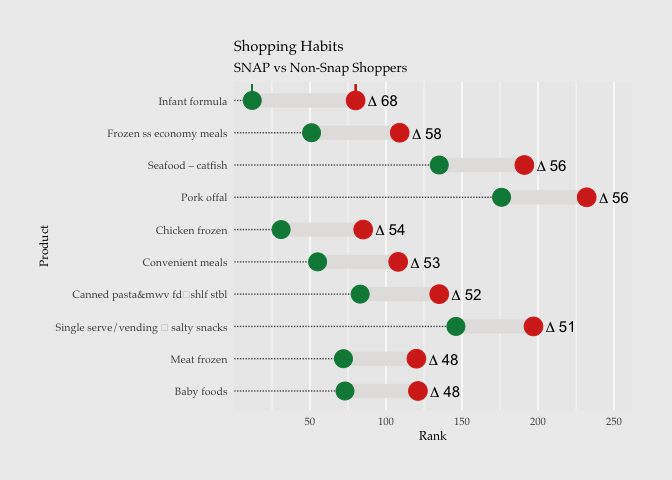

USDA SNAP Spending Study
========================

In November 2016, the United States Department of Agriculture [published
a
study](https://www.fns.usda.gov/snap/foods-typically-purchased-supplemental-nutrition-assistance-program-snap-households)
that used “calendar year 2011 point-of-sale transaction data from a
leading grocery retailer to examine the food choices of \[Supplemental
Nutrition Assistance Program (SNAP)\] and non-SNAP households.”

This repository is brought to you by [Data Is
Plural](https://tinyletter.com/data-is-plural), a weekly newsletter of
useful/curious datasets.

    library(readr)
    library(ggplot2)
    library(ggalt)
    library(dplyr)

    ## 
    ## Attaching package: 'dplyr'

    ## The following objects are masked from 'package:stats':
    ## 
    ##     filter, lag

    ## The following objects are masked from 'package:base':
    ## 
    ##     intersect, setdiff, setequal, union

    library(forcats)
    library(fuzzyjoin)

    tab <- read_tsv("commodities-spending.tsv")

    ## Parsed with column specification:
    ## cols(
    ##   commodity = col_character(),
    ##   snap_rank = col_integer(),
    ##   snap_spending = col_double(),
    ##   snap_pct_of_total = col_double(),
    ##   nonsnap_rank = col_integer(),
    ##   nonsnap_spending = col_double(),
    ##   nonsnap_pct_of_total = col_double()
    ## )

    snap <- tab %>%
      mutate(rank_diff = snap_rank - nonsnap_rank,
             pct_diff =  snap_pct_of_total - nonsnap_pct_of_total)

    lgRankDiff <- snap %>%
      top_n(-10, rank_diff) %>%
      arrange(rank_diff)

    # Set up variables for vectorized labeling on chart
    labs <- abs(lgRankDiff$rank_diff)
    lab_y <- 10:1
    lab_x <- lgRankDiff$nonsnap_rank + 18

    g <- ggplot(lgRankDiff, aes(y = fct_reorder(commodity, -rank_diff), x = snap_rank, xend = nonsnap_rank))
    g <-  g + geom_dumbbell(size=5, color="#e3e2e1", 
                 colour_x = "#008744", colour_xend = "#d62d20",
                 dot_guide=TRUE, dot_guide_size=0.5)
    g <-  g + xlab("Rank")
    g <-  g + ylab("Product")
    g <-  g + ggtitle("Shopping Habits", subtitle = "SNAP vs Non-Snap Shoppers")
    g <-  g + geom_segment(aes(x = snap_rank[1], 
                    xend = snap_rank[1] , 
                    y = 10.1, 
                    yend = 10.4),
                    colour = '#008744')  
    g <-  g + geom_segment(aes(x = nonsnap_rank[1], 
                   xend = nonsnap_rank[1], 
                   y = 10.1, 
                   yend = 10.4),
                   colour = '#d62d20')
    g <-  g + geom_text(aes(x = lab_x, y = lab_y, label = paste0("Delta~", "", labs), fontface = "plain"), parse = TRUE, size = 4)
    g <-  g + geom_text(aes(label = "Snap Rank", x = snap_rank[1] + 7, y = 10.5), size = 3) 
    g <-  g + geom_text(aes(label = "Non-Snap Rank", x = nonsnap_rank[1], y = 10.5), size = 3) 
    g <-  g + theme(plot.background=element_rect(fill = "grey93", colour = "grey93"))
    g <-  g + theme(plot.title=element_text(size = 11, hjust = 0))
    g <-  g + theme(text = element_text(family = "Palatino"))
    g <-  g + theme(axis.text.x=element_text(size = 8))
    g <-  g + theme(axis.text.y=element_text(size = 8)) 
    g <-  g + theme(axis.title.x=element_text(size = 9)) 
    g <-  g + theme(axis.title.y=element_text(size=9)) 
    g <-  g + theme(axis.ticks=element_blank()) 
    g <-  g + theme(panel.grid.major.y=element_blank())
    g <-  g + theme(plot.margin=margin(30,30,30,30))
    g

